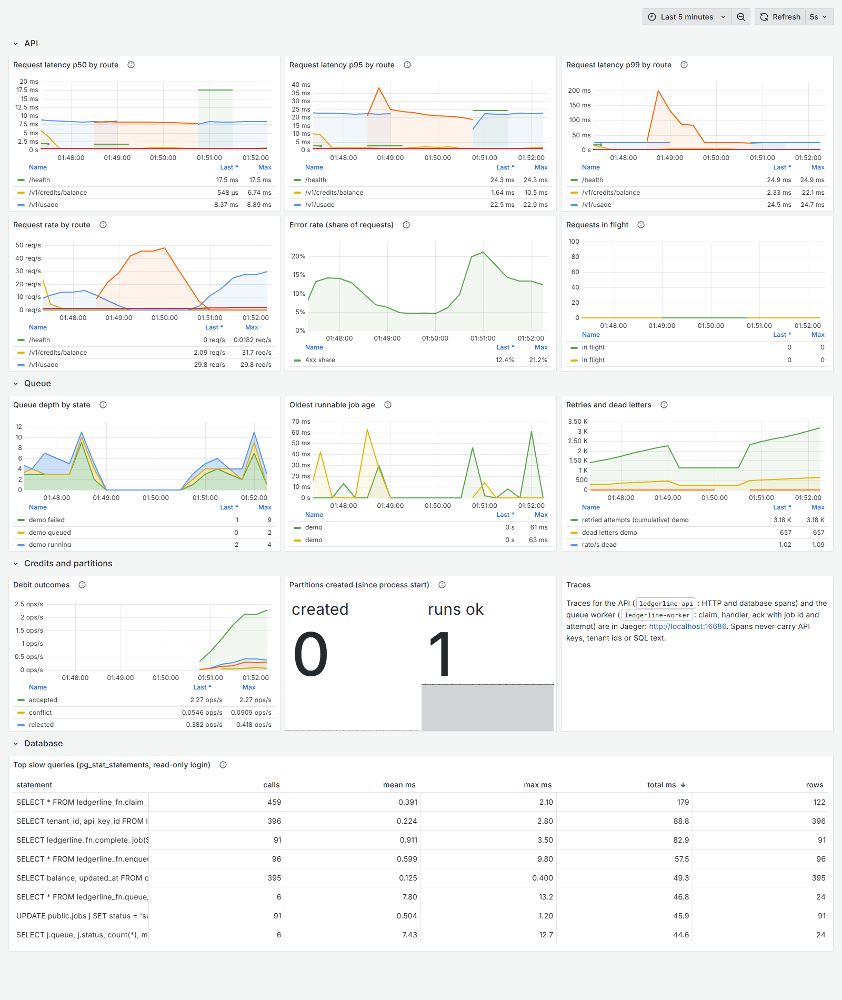

# Observability (P1.12)

Traces, metrics and a Grafana dashboard for the API and the queue worker. Development setup only.

## Run it

```bash
docker compose up -d                      # Postgres (as before)
pnpm migrate                              # creates the read-only ledgerline_metrics role and queue_stats()
docker compose --profile obs up -d        # Prometheus :9090, Jaeger :16686 (OTLP/HTTP :4318), Grafana :3001

# the API and the demo worker, with /metrics reachable from the containers and traces on
export METRICS_HOST=0.0.0.0 OTEL_EXPORTER_OTLP_TRACES_ENDPOINT=http://localhost:4318/v1/traces
HOST=0.0.0.0 pnpm --filter @ledgerworks/ledgerline dev            # API :3000, metrics :9464
pnpm --filter @ledgerworks/ledgerline demo:queue 300 25            # queue traffic: metrics :9465
```

Open http://localhost:3001/d/ledgerline-overview (anonymous viewer; admin password `ledgerworks-dev`). Run a k6 scenario (`ledgerline/k6/run.sh balance huge demo 100`) to see request panels move. Images are pinned (`prom/prometheus:v2.55.1`, `grafana/grafana:11.3.1`, `jaegertracing/all-in-one:1.62.0`). The datasources and the dashboard are provisioned from `ledgerline/observability/` (the dashboard JSON is generated by `build-dashboard.mjs` and committed).



The screenshot was taken while k6 ran `usage-read` at 10 it/s and `balance` at 100 req/s against the huge tenant, with bad-key and unknown-route requests mixed in and `demo:queue` running at 25 jobs/s.

## Surface and security

- **`/metrics` is not on the API port.** It is served by a second Fastify instance (`src/observability/metrics-server.ts`) on `METRICS_HOST:METRICS_PORT` (default **127.0.0.1:9464**); the API app answers 404 for `/metrics` (tested). It serves nothing else and can require `Authorization: Bearer $METRICS_TOKEN`.
- **For the Docker profile, Prometheus reaches the host through `host.docker.internal`, which cannot see a loopback-only socket,** so the example sets `METRICS_HOST=0.0.0.0`. That exposes the metrics port on every interface of the machine: do it on a development machine only (or set `METRICS_TOKEN` and a firewall rule). A real deployment scrapes over a private network.
- **Cross-tenant queue statistics** come from one `SECURITY DEFINER` function, `ledgerline_fn.queue_stats()` (migration 0011), executable only by the read-only login `ledgerline_metrics`. That login has `pg_read_all_stats` and no table privileges (asserted in the isolation tests). It returns aggregates only: no tenant id, job id, payload or error text.
- **Grafana's "top slow queries" panel** reads `pg_stat_statements` through the same read-only login. The statement text is visible to dashboard viewers in that table; it is never a metric label.
- **Labels (tested):** `route` (the route pattern, `unmatched` for 404s, never the raw path), `method`, `status`, debit `outcome`, `queue`, job `state`, worker `event`, partition `result`. No tenant id, API key, request path with ids, error message or SQL text. `test/observability.test.ts` sends requests with a real key and tenant id, a 404 whose path contains both, a failing job whose error message contains a tenant id, a key and SQL text, then asserts none of them (nor any UUID, `lk_` key prefix or SQL keyword) appears anywhere in the exposition.
- **Traces (tested):** HTTP server spans (route pattern, method, status), database client spans named only by operation (`db SELECT`, `db BEGIN`, ...; never SQL text or parameters), and for the worker `queue.claim`, `queue.handler` and `queue.ack` spans with the job id, type, queue and attempt number. Tracing is off unless `OTEL_EXPORTER_OTLP_TRACES_ENDPOINT` is set.

## Metrics

| Metric                                                                               | Type                            | Labels                                                        |
| ------------------------------------------------------------------------------------ | ------------------------------- | ------------------------------------------------------------- |
| `ledgerline_http_request_duration_seconds`                                           | histogram                       | `route`, `method`, `status`                                   |
| `ledgerline_http_requests_in_flight`                                                 | gauge                           | none                                                          |
| `ledgerline_credit_debits_total`                                                     | counter                         | `outcome` = accepted, rejected, replayed, conflict            |
| `ledgerline_queue_jobs`                                                              | gauge                           | `queue`, `state` (queued, running, failed, succeeded, dead)   |
| `ledgerline_queue_oldest_runnable_job_age_seconds`                                   | gauge                           | `queue`                                                       |
| `ledgerline_queue_retried_attempts`                                                  | gauge (cumulative)              | `queue`                                                       |
| `ledgerline_worker_job_events_total`                                                 | counter (per process)           | `event` = claimed, completed, retried, dead, abandoned, stale |
| `ledgerline_partitions_created_total`, `ledgerline_partition_maintenance_runs_total` | counters                        | `result` for runs                                             |
| `ledgerline_process_*`                                                               | default Node.js process metrics |                                                               |

Debit and partition counters live in the process that performs the operation (the debit counter is incremented by the credit helper wherever it runs, which today is the demo worker and the tests: there is no HTTP debit endpoint yet).

## Cardinality after a load run

`ledgerline/k6/series-count.sh` after the screenshot's load (k6 `usage-read` 10 it/s and `balance` 100 req/s, plus bad requests and `demo:queue`): **192 distinct series on the API metrics port, of which 96 are the request-duration histogram** (route x method x status x 14 histogram series), and **103 series on the demo worker's port** (raw: `benchmarks/raw/p1.12-series-count-2.txt`). The number is bounded by routes x statuses; unknown paths all collapse into `route="unmatched"`. (A first count of 229 and 138 in `p1.12-series-count-1-with-blank-lines.txt` counted the blank separator lines of the exposition format; the script was fixed and re-run.)
