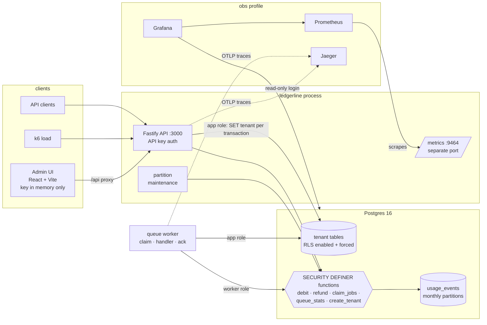

# Ledgerline

A multi-tenant backend for **usage metering, credits and background jobs**, built to be measured: Postgres row-level security, a race-free credit ledger, a leased job queue, partitioned usage data, and a load-test report with an optimization log in which most changes were tried, measured, and some rejected.

**Who it is for:** a developer building an AI product who needs per-customer usage metering, credits and background jobs without writing them from scratch (see [PRODUCT.md](../PRODUCT.md)).

All data is **synthetic**. All numbers below were measured on one laptop with the load generator, the API and Postgres competing for the same CPUs, so they are **relative** (before against after), not absolute capacity. Every number links to the file it came from.

## Results

### Headline: two real performance wins out of eight changes tried

| What                                                                                                                                                  | Before                                                                                                                                   | After                                                                                                               | Source                                                                                                                                                            |
| ----------------------------------------------------------------------------------------------------------------------------------------------------- | ---------------------------------------------------------------------------------------------------------------------------------------- | ------------------------------------------------------------------------------------------------------------------- | ----------------------------------------------------------------------------------------------------------------------------------------------------------------- |
| `GET /v1/usage`, huge tenant (2.5M events of 10M), p95 at 2 iterations/s                                                                              | 161.2 ms (160.7–165.6)                                                                                                                   | **29.4 ms** (29.1–51.5)                                                                                             | [after.md](../docs/benchmarks/after.md) (baseline code re-run in the same session, interleaved)                                                                   |
| Cause of that win                                                                                                                                     | `ORDER BY` resolved to an output alias, so the index order was unusable. **An application bug, not an indexing win**; no index was added | one-word fix                                                                                                        | [optimization-log E1](../docs/optimization-log.md)                                                                                                                |
| Saturation of that endpoint (huge tenant)                                                                                                             | queued already at 5 it/s: p95 16.74 s, 81 dropped iterations; at 20 it/s 36.6% of requests timed out                                     | 5, 10, 20, 40 and 100 it/s all with **0 dropped**; **saturates between 100 and 200 it/s** (200 it/s: 1,135 dropped) | [baseline.md](../docs/benchmarks/baseline.md#saturation-re-run-on-unmodified-code-raw-files-kept), [after.md](../docs/benchmarks/after.md)                        |
| Job queue throughput, one method (`pnpm --filter @ledgerworks/ledgerline bench:queue`: 10,000 no-op jobs, 50 workers, fresh database per run, 3 runs) | 64.5 jobs/s (64.0–67.0)                                                                                                                  | **253.1 jobs/s** (250.1–257.7), 3.9x                                                                                | [before](../docs/benchmarks/raw/queue-throughput-o6-before.txt), [after](../docs/benchmarks/raw/queue-throughput-o6-after.txt), [E3](../docs/optimization-log.md) |
| Cheap endpoints (`balance`, `ingest`), p95                                                                                                            | 7.7–9.9 ms                                                                                                                               | unchanged within noise (no regression)                                                                              | [after.md](../docs/benchmarks/after.md)                                                                                                                           |

The queue figure above uses one defined method. The full-size concurrency test (`pnpm test:concurrency`) prints a jobs/s number too (257, 360 and 404 jobs/s in three sessions with identical code, see [E3](../docs/optimization-log.md) and the sessions' output), but it runs inside the test harness against a freshly migrated test database and also asserts correctness; it is **not** comparable with the benchmark and is not used for the headline. The spread between sessions is itself a result: see "Honest limits".

### Storage and operations wins (not latency)

| What                                                                                  | Result                                                                                                                                           | Source                                                                                                             |
| ------------------------------------------------------------------------------------- | ------------------------------------------------------------------------------------------------------------------------------------------------ | ------------------------------------------------------------------------------------------------------------------ |
| Dropping a month of data: `DELETE` against partition `DETACH` + `DROP` (547,332 rows) | `DELETE` 2.07–5.34 s; `DETACH` + `DROP` about 25–32 ms; no dead tuples to vacuum                                                                 | [raw/retention-e6.txt](../docs/benchmarks/raw/retention-e6.txt), [E6](../docs/optimization-log.md)                 |
| Automatic monthly partition creation (ingest never fails at a month boundary)         | 900 events by 30 workers across a month boundary while the job ran: **900 accepted, 0 failed**; 30 concurrent callers create each partition once | [partitions.test.ts](test/partitions.test.ts), [E6](../docs/optimization-log.md)                                   |
| Redundant ledger index dropped                                                        | bulk insert faster in 5 of 5 pairs (about 10–34%, ranges overlap); single debit latency **not measurable**; 4.08 MB less per 100k rows           | [raw/ledger-write-cost-o5.txt](../docs/benchmarks/raw/ledger-write-cost-o5.txt), [E4](../docs/optimization-log.md) |
| Unused queue index dropped                                                            | `idx_scan = 0` on a mixed workload; no latency claim                                                                                             | [raw/job-index-usage-b.txt](../docs/benchmarks/raw/job-index-usage-b.txt), [E8](../docs/optimization-log.md)       |

### Null and negative results (kept in the log, not hidden)

- **Usage-read access pattern (E2):** the existing index and keyset pagination were already right; no change. [E2](../docs/optimization-log.md)
- **Fewer round trips per request (E5):** merging `BEGIN` and `set_config` saved about 0.35 ms in the database path (3 of 3 rounds) and **nothing measurable end to end**; reverted. [E5](../docs/optimization-log.md), [raw/request-flow-o3.txt](../docs/benchmarks/raw/request-flow-o3.txt)
- **Partitioning does not speed up reads (E6):** partitioned reads were 12–24% slower per query than an unpartitioned copy (0.03–0.06 ms). Partitioning pays for retention, not latency. [raw/pgbench-e6-partitioned-vs-flat.txt](../docs/benchmarks/raw/pgbench-e6-partitioned-vs-flat.txt)
- **RLS policy rewrites (E7):** the best behaviour-preserving rewrite saves 0.014 ms, below the noise; not adopted. [E7](../docs/optimization-log.md)

Changes tried: **8** log entries (E1–E8): **2** real latency/throughput wins (E1, E3), **3** storage/operations/cleanup changes (E4, E6, E8), **3** null or negative results (E2, E5, E7). The target of three real performance improvements was **not** met if only latency and throughput count. [Optimization log](../docs/optimization-log.md)

### Correctness and safety

| What                            | Result                                                                                                                                                                                                      | Source                                                                                                                                                      |
| ------------------------------- | ----------------------------------------------------------------------------------------------------------------------------------------------------------------------------------------------------------- | ----------------------------------------------------------------------------------------------------------------------------------------------------------- |
| Credit debits under concurrency | 50 workers, 10,000 debits: **no overdraft, no double-spend, ledger sum equals balance** (4,564 accepted, 5,436 rejected for insufficient credits in the last run); same idempotency key never double-debits | [credits.test.ts](test/credits.test.ts)                                                                                                                     |
| Mutation check on the row lock  | with `FOR UPDATE` removed the test **fails**: 10,000 accepted, 0 rejected (the earlier mutation run also showed negative ledger sums, see D18)                                                              | [raw/mutation-check-row-lock-after-0005.txt](../docs/benchmarks/raw/mutation-check-row-lock-after-0005.txt), [D18](../DECISIONS.md), [D21](../DECISIONS.md) |
| Tenant isolation                | **182 isolation tests, 772 assertions**: every tenant-owned table × SELECT/INSERT/UPDATE/DELETE × tenant A, tenant B, no tenant, no privileges; money moves only through two `SECURITY DEFINER` functions   | [isolation.test.ts](test/isolation.test.ts), [D14](../DECISIONS.md), [D15](../DECISIONS.md), [D21](../DECISIONS.md)                                         |
| Job queue                       | 50 workers, 10,000 jobs: no job executed twice, none lost; retries with backoff and dead letters                                                                                                            | [queue-10k.test.ts](test/concurrency/queue-10k.test.ts), [queue.test.ts](test/queue.test.ts), [D19](../DECISIONS.md)                                        |

### What row-level security costs

|                                                                 | Result                                                                                                         | Source                                                |
| --------------------------------------------------------------- | -------------------------------------------------------------------------------------------------------------- | ----------------------------------------------------- |
| Database level, same transactions with and without the policies | **+0.07 to +0.16 ms per transaction** (14–23% of database time), slower with RLS in 12 of 12 paired rounds     | [rls-overhead.md](../docs/benchmarks/rls-overhead.md) |
| End to end through the API (k6, 3 runs per mode)                | **within the noise**: no difference in p50, p95, p99 or throughput that the run-to-run spread does not swallow | [rls-overhead.md](../docs/benchmarks/rls-overhead.md) |

### Observability and admin UI

- **Dashboard under load:** [docs/img/grafana-dashboard-under-load.png](../docs/img/grafana-dashboard-under-load.png); **192 distinct metric series** after a load run ([raw](../docs/benchmarks/raw/p1.12-series-count-2.txt)); `/metrics` is not on the API port; no tenant id, key or SQL text in any label (tested). [docs/observability.md](../docs/observability.md)
- **Admin UI:** [huge tenant](../docs/img/admin-ui-huge.png), [small tenant](../docs/img/admin-ui-small.png); 20 component tests and 4 Playwright tests against the real API and database. [D28](../DECISIONS.md)

## Architecture



- **Isolation:** the API sets the tenant per transaction (`set_config(..., true)`); policies compare `tenant_id` with it. The app role is not a superuser and cannot bypass RLS. Details and risks: [DECISIONS.md](../DECISIONS.md) (D14, D15).
- **Money:** only `debit_credits` and `refund_credits` can change the ledger and balances (`SECURITY DEFINER`, tenant-scoped policies, row lock, idempotency keys). [D18, D21](../DECISIONS.md)
- **Queue:** `FOR UPDATE SKIP LOCKED` with leases, retries, backoff, dead letters; at-least-once. [D19, D22](../DECISIONS.md)
- **Usage data:** range-partitioned by month, created automatically. [D24, D26](../DECISIONS.md)

## One-command demo

Needs Docker, Node 22+ and pnpm 9.

```bash
git clone <this repository> ledgerworks && cd ledgerworks
pnpm install --frozen-lockfile
pnpm demo
```

`pnpm demo` starts Postgres in Docker, applies the migrations, loads a small synthetic demo seed (about a second), starts the API (http://localhost:3000) and the admin UI (http://localhost:5173), and prints a synthetic demo API key. Open the UI and paste the key. Stop with Ctrl-C (`docker compose down` stops Postgres). The transcript of this run from a fresh clone is in [docs/demo-transcript.md](../docs/demo-transcript.md).

Other things you can run:

| Command                                    | What                                                                                                                                               |
| ------------------------------------------ | -------------------------------------------------------------------------------------------------------------------------------------------------- |
| `pnpm lint && pnpm typecheck && pnpm test` | checks (needs Postgres from `docker compose up -d`)                                                                                                |
| `pnpm test:concurrency`                    | full-size queue test (50 workers, 10,000 jobs)                                                                                                     |
| `pnpm e2e`                                 | Playwright tests of the admin UI (needs a seeded database: `pnpm seed:demo`, or `pnpm seed --yes` for the 10M-row benchmark seed, about 7 minutes) |
| `docker compose --profile obs up -d`       | Prometheus, Grafana, Jaeger; see [docs/observability.md](../docs/observability.md)                                                                 |
| `ledgerline/k6/run-all.sh`                 | the baseline load matrix (needs the 10M-row seed; method in [baseline.md](../docs/benchmarks/baseline.md))                                         |

## What I measured and how

- **Seed and environment:** 10,000,000 synthetic usage events over 250 tenants with a Zipf skew (the largest tenant holds 25%), Postgres 16.15 in Docker limited to 2 CPUs / 2 GiB, Intel Core i5-1135G7 laptop, k6 v2.3.0 in Docker, API under `tsx`. [seed.md](../docs/benchmarks/seed.md), [raw/environment-p1.10-final.txt](../docs/benchmarks/raw/environment-p1.10-final.txt)
- **Load profile:** 30 s warmup (excluded) then 60 s measured at a constant arrival rate, 3 runs per scenario, medians with min–max, a preflight on every run. [baseline.md](../docs/benchmarks/baseline.md)
- **Before and after:** the baseline code re-run in the same session as the final code, interleaved round by round, because the machine drifts between sessions. [after.md](../docs/benchmarks/after.md)
- **Every change** has an entry with the slow query, `EXPLAIN (ANALYZE, BUFFERS)` before and after, the change, and measured before and after with spread, plus write and storage cost. [optimization-log.md](../docs/optimization-log.md)
- **Raw output** of every run is kept in [docs/benchmarks/raw/](../docs/benchmarks/raw/) (including aborted and invalid runs, with notes explaining them).
- **Decisions** with options, choice and risks: [DECISIONS.md](../DECISIONS.md).

## Honest limits

- **One laptop.** k6, the API and Postgres compete for the same CPUs, so the numbers are relative (before against after on this machine), not absolute capacity.
- **Machine drift between sessions.** The same cheap endpoint had a p50 of 3.7–4.1 ms in one session, 6.0–6.6 ms in another and 7–8 ms in the recorded baseline, on unchanged code. Only same-session, interleaved before/after pairs are used for attribution; the recorded baseline is shown for continuity. The queue test's jobs/s varied between 257 and 404 for the same code for the same reason.
- **The first baseline re-run was invalid** (the baseline API failed to start with `EADDRINUSE` and the final code answered instead). It was detected, disclosed, kept in the raw folder with a note, and re-run after fixing the script. [after.md](../docs/benchmarks/after.md)
- **Bottleneck above 100 iterations/s not identified.** The huge-tenant read saturates between 100 and 200 it/s; whether Postgres (2 CPUs), the single Node process or k6 limits it was not determined.
- **Not investigated:** p95 at 20 and 40 it/s was lower than at 5 it/s; probably warm connections and caches, but not tested.
- **Synthetic data.** Tenant skew, event types and timing are generated; real workloads differ.
- **At-least-once delivery, not exactly-once.** A job whose worker crashes after the side effect but before the acknowledgement can run again after its lease expires; handlers must be idempotent. [D19](../DECISIONS.md)
- **A compromised API process is out of scope for the database.** Whoever can run `set_config('app.tenant_id', ...)` on an app connection chooses the tenant; the API sets it only from the verified key. [D14](../DECISIONS.md)
- **A raw API key typed into a browser** is exposed to anything running in that page; the UI keeps it in memory only, which limits persistence, not exposure. [D28](../DECISIONS.md)
- **Few real wins.** Only 2 of 8 changes improved latency or throughput measurably; that is the honest result, and the null results are in the log.
- **CI:** the Playwright job and the secret scan are defined in `.github/workflows/ci.yml`; I could only run the end-to-end tests locally, not on GitHub's runners.
- **The demo queue worker** (`pnpm --filter @ledgerworks/ledgerline demo:queue`, used for the dashboard screenshot) writes jobs and debits into the database it runs against; re-seed to reset.
- **Not built yet:** an HTTP endpoint for debits and for granting credits, rate limiting, key rotation.

## Project status

Phase 1 of [plan.md](../plan.md) (Ledgerline) is complete. Phases 2 to 4 (a shared engine, a query tuner and a migration lock checker built on top of this backend) are planned and not started. This is a portfolio project: issues and pull requests are not being triaged.

License: [MIT](../LICENSE).
